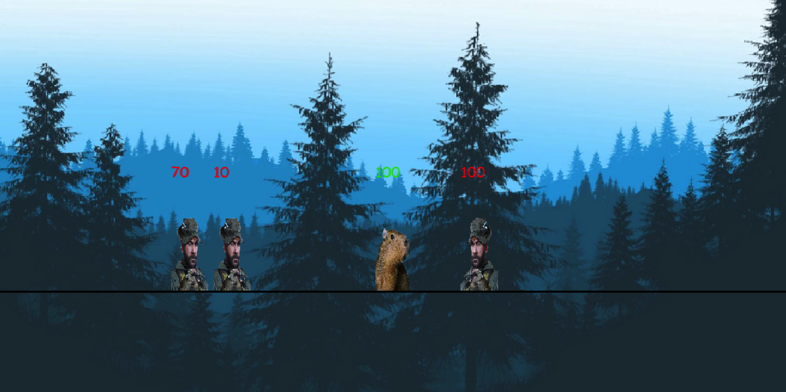

# Задание 1. Поворот NPC в зависимости от его движения

## Что нужно сделать?
В зависимости от movement.x вызывать функцию self.flip_image() с параметром is_facing_left=True для отрицательного движения по x и с параметром is_facing_left=False для положительного движения по x.

## Где нужно сделать?
В функции update у класса NPC.

## Как должно выглядеть в итоге
Во время движения к игроку справа и слева каждый из нпс повернут к нему лицом

# Задание 2. Выход из игры после сметри игрока
## Что нужно сделать?

Сейчас в основном цикле игры, когда у игрока становится 0 hp, вызывается функция player_group.remove(player), игра продолжается без игрока, смысла в этом мало. Поэтому вместо удаления игрока нужно вызвать функцию exit().

## Где нужно сделать?
В основном цикле игры в first_game.

## Как должно выглядеть в итоге
После смерти игрока программа завершается (протестируй).