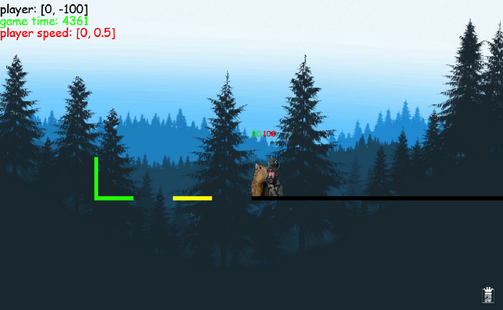

# Задание 1. Убрать npc1 и npc2 из начала игры.

## Что нужно сделать?
Удалить создание npc1 и npc2, удалить закомментированную строку с добавлением npc в группы npc_group.add

## Где нужно сделать?
В first_game.py

# Задание 2. Начало координат игры

## Что нужно сделать?
Изменить точку спавна игрока на координаты (0,0). Заменить стены на

```Python
walls_group.add(
    [
        Wall(x=0, y=0, width=10000, height=10, color='black' ),
        Wall(x=-200, y=0, width=100, height=10, color='yellow' ),
        Wall(x=-400, y=0 ,width=100, height=10, color='green' ),
        Wall(x=-400, y=-100, width=10, height=100, color='green' ),
    ]
)
```

## Где нужно сделать?
В first_game.py, создание игрока это вызов класса PlayerKapibara(), нужно сделать player_x=0, player_y=0. Стены создаются там же чуть ниже.

## Как должно выглядеть в итоге
Должны появиться новые стены, позиция игрока должна быть как на скриншоте. Сделай и пришли свой скриншот экрана


