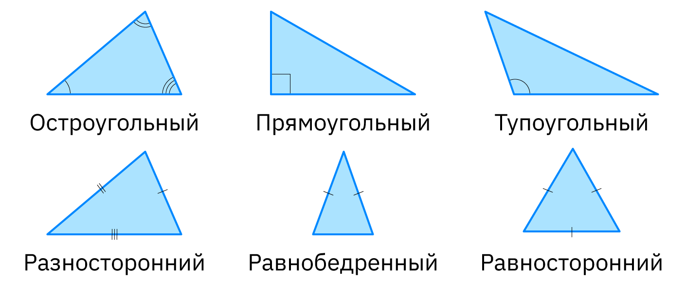
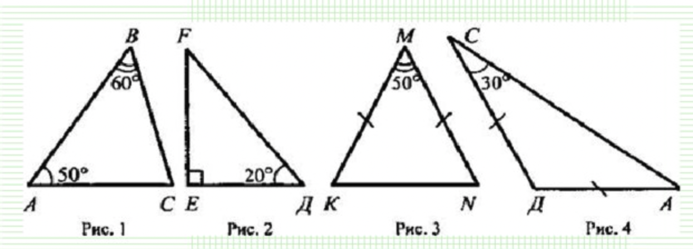
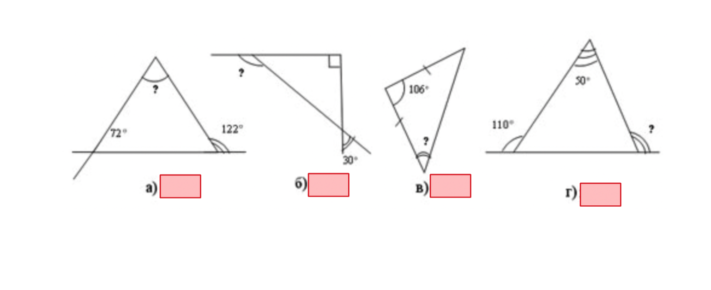
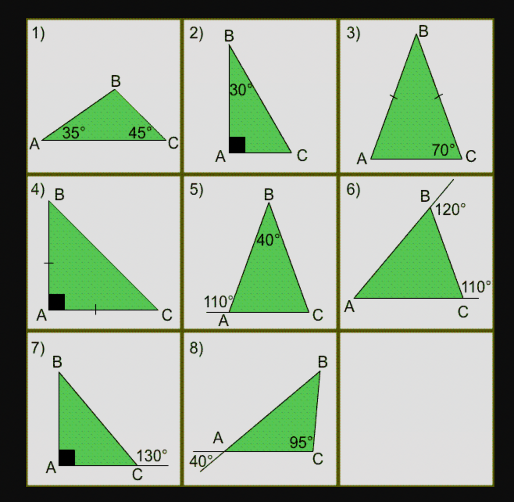
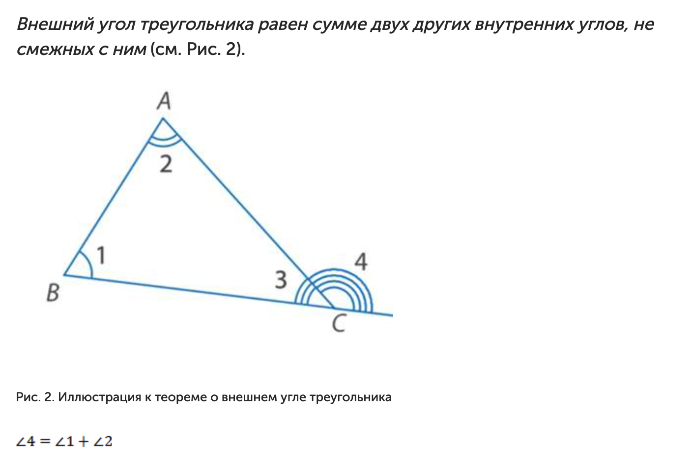

# Типы треугольников и обозначение одинаковых углов и сторон

- Равные стороны обозначаются полосками. Если одна сторона равна другой у неё будет одинаковое количество полосок (см. равносторонний треугольник на иллюстрации, у него все три стороны обозначаются одинаково по одной полоске).

- Равные углы обозначаются дугами.

- Сумма углов в треугольнике равна 180 градусам.

# Задание 1. Вычислить неизвестные углы

# Задание 2. Вычислить неизвестные углы у треугольников с развернутыми углами

# Задание 3. Вычислить два неизвестных угла каждого треугольника

# Задание 4. Теорема о внешнем угле треугольника (попробуй доказать исходя из того, что сумма углов треугольника равна 180)

